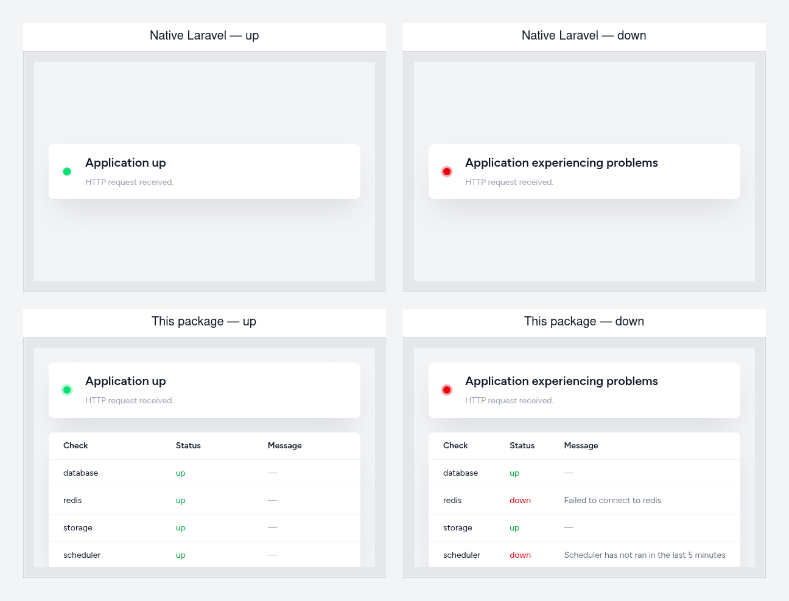

# Health Check Package

Laravel includes a [built-in health check route](https://laravel.com/docs/deployment#the-health-route) that reports the status of your application to an uptime monitor, load balancer, or orchestration system such as Kubernetes: by default served at `/up`, returning `200` if the application booted without exceptions and `500` otherwise, and dispatching `Illuminate\Foundation\Events\DiagnosingHealth` so you can throw from a listener to fail the check.

This package **is** that health route — it registers the endpoint itself, dispatches the same `DiagnosingHealth` event, and fails the same way (throwing). Nothing about the wiring is different; what you get on top is:

- **A library of ready-made checks** (database, cache, Redis, storage, FTP, outbound HTTP, pending migrations, scheduler liveness, Composer package security, cross-service) instead of writing your own `DiagnosingHealth` listeners from scratch.
- **A `degrade()` path alongside `fail()`** — report a check as unhealthy without dropping the endpoint to a `500`, for problems you want visible but not paging on-call.
- **The same JSON and HTML Laravel already returns, extended, not replaced** — JSON is still `{"status": "up"|"down"}` with a `checks` breakdown added; the HTML page is Laravel's own health page markup with a per-check table added below it. Point an existing uptime monitor at this endpoint and nothing about the contract it already expects changes.
- **A facade, Artisan command (`health-check:status --only=... --except=...`), and route middleware** (basic auth or header-token gating, `X-{check}-status` response headers) for querying check status outside the HTTP route too.
- **A publishable static ping file** — copy `pong` to `public/ping` and commit it, so the web server can answer a cheaper "is the box up?" signal without booting PHP at all.

Because it *is* the framework's health route rather than a second one beside it, **omit** the `health:` argument in `bootstrap/app.php`'s `withRouting()` — this package registers the route (same default `/up`, configurable via `HEALTHCHECK_PATH`) so there's only one to keep straight.



Upgrading from 2.x? See [UPGRADE.md](UPGRADE.md).

## Installation

```bash
composer require ans-group/laravel-health-check
```

The service provider is auto-discovered. In `bootstrap/app.php`, do **not** pass `health:` to `withRouting()`:

```php
return Application::configure(basePath: dirname(__DIR__))
    ->withRouting(
        web: __DIR__.'/../routes/web.php',
        commands: __DIR__.'/../routes/console.php',
    )
    ->create();
```

Hit the health endpoint (JSON: send `Accept: application/json`). Overall `status` is `up` or `down`; each check is listed under `checks`.

## Configuration

Publish the config (and optionally the HTML view):

```bash
php artisan vendor:publish --provider="UKFast\HealthCheck\HealthCheckServiceProvider" --tag="config"
php artisan vendor:publish --provider="UKFast\HealthCheck\HealthCheckServiceProvider" --tag="healthcheck-views"
```

### Health endpoint path

Same role as Laravel's `health:` option:

```php
'path' => env('HEALTHCHECK_PATH', '/up'),
```

Change `HEALTHCHECK_PATH` or `'path'` in config. Middleware on that route is `healthcheck.middleware`.

### Authentication

The health endpoint is public by default — the same as Laravel's native one. Add `Authenticate` to `healthcheck.middleware` to gate it:

```php
'middleware' => [
    \UKFast\HealthCheck\Middleware\Authenticate::class,
],
```

It accepts HTTP basic auth, a header token, or both — either passing is enough, so an old monitoring system that can only do basic auth and a new one sending a header can hit the same endpoint at once (useful mid-migration). Configure whichever you need:

```php
'auth' => [
    // HTTP basic auth, for older monitoring systems that can't send custom headers
    'user' => env('HEALTH_CHECK_USER'),
    'password' => env('HEALTH_CHECK_PASSWORD'),

    // A shared secret sent as a request header, for anything that can send custom headers
    'header' => env('HEALTH_CHECK_AUTH_HEADER', 'X-Health-Check-Token'),
    'token' => env('HEALTH_CHECK_AUTH_TOKEN'),
],
```

Leaving `user`/`password` unset disables basic auth; leaving `token` unset disables the header token — each method is independently opt-in. A caller that fails both still gets the real HTTP status code back, just no body, so an unauthenticated monitor can tell "up or down" without seeing check detail.

### Ping (published static file)

The package does **not** register a ping route or write anything at runtime. Publish the stub once:

```bash
php artisan vendor:publish --provider="UKFast\HealthCheck\HealthCheckServiceProvider" --tag="healthcheck-ping"
```

That copies `pong` to `public/ping`. Commit the file like any other published asset — the web server can then serve it directly without booting Laravel, and there's no runtime dependency on `public/` being writable.

### Facade

```php
if (HealthCheck::passes('env')) {
    // check passed
}

if (HealthCheck::fails('http')) {
    // check failed
}

$numberOfChecks = HealthCheck::all()->count();
```

A missing check name throws `CheckNotFoundException`.

### Console

```bash
php artisan health-check:status
php artisan health-check:status --only=log,cache
php artisan health-check:status --except=cache
```

### Middleware

Configure `healthcheck.middleware` for the health endpoint. Built-in:

- `Authenticate` — gate the endpoint behind basic auth, a header token, or both. See [Authentication](#authentication) above.
- `AddHeaders` — `X-{check}-status` headers

## Checks

Register classes under `healthcheck.checks`. Bundled checks include log, database, env, cache, Redis, HTTP, storage, FTP, migrations, scheduler, package security, and cross-service.

### Scheduler

The scheduler check uses a time-limited cache key. Schedule the command every minute:

```php
$schedule->command(CacheSchedulerRunning::class)->everyMinute();
```

Cache key and TTL are under `healthcheck.scheduler`.

### App listeners

You can still listen for `Illuminate\Foundation\Events\DiagnosingHealth` and throw to fail the health endpoint, as Laravel documents.

## Creating your own health checks

```bash
php artisan make:check RedisHealthCheck
```

Extend `UKFast\HealthCheck\HealthCheck`, set `$name`, and implement `check()`. Throw with `$this->fail()` when unhealthy, or `$this->degrade()` when the app should stay HTTP 200 but report a degraded check.

```php
<?php

namespace App\Checks;

use Exception;
use Illuminate\Support\Facades\Redis;
use UKFast\HealthCheck\HealthCheck;

class RedisHealthCheck extends HealthCheck
{
    protected string $name = 'my-fancy-redis-check';

    public function check(): void
    {
        try {
            Redis::ping();
        } catch (Exception $exception) {
            $this->fail('Failed to connect to redis', [
                'exception' => $this->exceptionContext($exception),
            ]);
        }
    }
}
```

Add the class to `healthcheck.checks`.

## Contributing

We welcome contributions that will be beneficial to the community.

Reach out via **open-source@ukfast.co.uk**. See [CONTRIBUTING](CONTRIBUTING.md).

## Security

Report vulnerabilities to **security@ukfast.co.uk**, not the issue tracker.

## Licence

MIT. See the [Licence](LICENSE) file.
